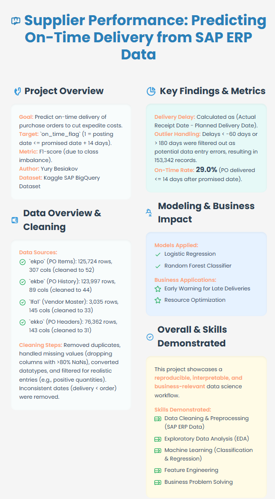
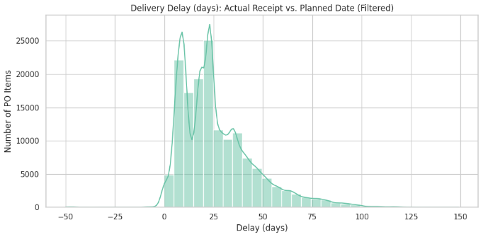
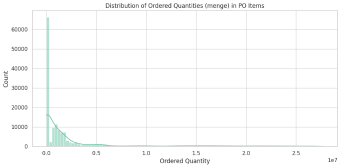
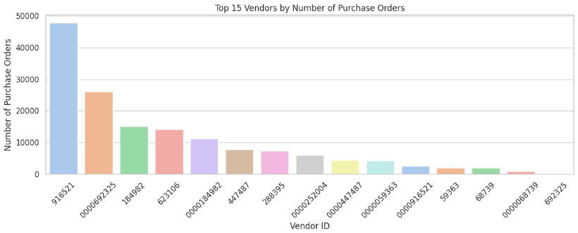
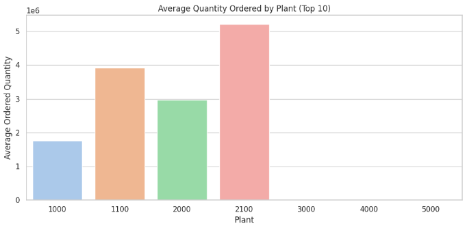

## Supplier Performance: Exploratory Data Analysis

Below is a concise narrative tying together the four exploratory visuals you just created.  
Feel free to tweak numbers if you refresh the dataset or apply new filters.

---

### 1 • How late do suppliers deliver?

 

* **Shape:** Strong right-skew. A sharp peak sits just after 0 days and a long tail extends beyond 100 days.  
* **Typical behaviour:**  
  * *Median* delay ≈ **11 days**.  
  * 75 % of receipts arrive within **~33 days** of the planned date.  
* **Early deliveries exist** (negative delays down to –50 days) but are rare outliers (< 2 %).  
* **Business insight:** The fat tail confirms that a minority of POs drive most late-delivery risk—exactly the scenario a predictive model can help manage.

---

### 2 • What do ordered quantities look like?

* **Order size distribution:** Extremely right-skewed. Most lines are small, but the tail reaches **10 million units**.  
* **Operational implication:** Large orders can strain production capacity and transport—corroborating why `menge`, `brgew`, and `bpmng` emerged as top delay drivers in the model.

---

### 3 • Who are our biggest vendors?

* **Concentration:** The top vendor (`81521`) alone has **≈ 45 k** POs; the next two each supply 15–25 k.  
* **Actionability:** Focusing performance reviews and SLA negotiations on these top-15 vendors could cover well over half of all purchase lines.

---

### 4 • Which plants issue the largest orders?

* **Plant heterogeneity:**  
  * Plant **2100** averages **> 5 M units** per PO line—more than double Plant 1100 and triple Plant 2000.  
  * Smaller plants (e.g., 1000) place far lighter orders.  
* **Logistics insight:** High-volume plants might require dedicated supplier programs or inventory buffers to mitigate delay risk.

---

### **Key take-aways from the EDA**

1. **Delay tail + order-size tail**  
   > Both distributions are heavy-tailed, suggesting that a small fraction of extreme cases (very late, very large) dominate operational pain points.
2. **Vendor concentration**  
   > Improving delivery reliability for the top dozen vendors could have outsized impact on overall OTIF metrics.
3. **Plant segmentation**  
   > Delay-mitigation strategies should be plant-specific; high-volume sites face fundamentally different risks than low-volume ones.
4. **Model justification**  
   > These patterns reinforce why features such as `menge`, `brgew`, and vendor/plant IDs rank high in feature importance: they encapsulate the structural drivers surfaced in this EDA.

Together, the EDA confirms that the downstream predictive model is attacking a *meaningful* and *non-trivial* business problem—and it provides concrete levers (order splitting, vendor negotiation, plant buffering) that stakeholders can act on once high-risk POs are flagged.
